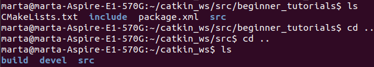

# ROS_Tutorials
Tutorials de ROS

# 2: Sistema de fitxers de ROS

En aquest tutorial se'ns presenten algunes funcions útils per tal d'accedir a paquets de ROS de manera senzilla; aquestes funcions es troben dins del paquet de **rosbash** , on trobem multitud de funcions per facilitar l'ús de ROS.

Per tal de navegar en el sistema de fitxers de ROS, hi ha una funció que retorna el path del paquet demanat; la funció és *rospack*

Si es vol accedir directament al directori, es pot fer servir la comanda *roscd* amb la qual ens portarà diectament al paquet que indiquem. Amb la comanda de linux *pwd* podem veure en quin directori estem.

Per tal d'accedir a informació sobre el paquet, es pot executar directament la comanda de *rosls* seguit del paquet del qual volem obtenir informació.

Una altra utilitat que ens ensenya és que amb el tabulador es pot escriure d'una manera més eficient per tal de no haver d'escriure noms llargs. En cas d'haver diverses opcions que comencin amb el mateix nom, es mostren en el terminal.

## RESUM

Per tant, les funcions a tenir en compte per a un millor ús de ROS són les següents:

- *rospack*, per tal de demanar el directori a on es troba un paquet en concret
- *roscd*, per accedir directament al directori a on es troba el paquet
- *rosls*, per tal d'obtenir directament la informació d'un paquet

Altres utiltats d'aquest tutorial són:

- La comanda *pwd*, per tal de mostrar el directori actual
- El tabulador, per tal d'escriure més ràpid

# 3: Creació d'un paquet amb ROS

Aquest tutorial permet la creació de un primer paquet amb ROS.

Per tal de considerar un paquet de *catkin* com a tal, ha de complir els següents requisits:

- Tenir un fitxer **package.xml** compatible amb *catkin*
- Tenir un **CMakelists.txt** que utilitzi *catkin*
- Tenir la seva pròpia carpeta

Per aquests paquets es recomana utilitzar un espai de treball de *catkin*. Anteriorment en el primer tutorial ja hem creat aquest espai de treball de *catkin*, amb el qual també vam crear el *CMakelists.txt*. 

Per tal de crear un paquet, ens posem a la carpeta *src*; es farà servir la comanda *catkin_create_pkg*, la qual seguirà la següent estructura:

*catkin_create_pkg <package_name> [depend1] [depend2] [depend3]*

En el qual hi posarem el nom del paquet a crear i les dependències de les quals dependrà el paquet.

Dins del paquet *beginner_tutorials* observem que s'han creat els arxius *package.xml* i el *CMakelists.txt*.

Per tal de fer el un *build* al paquet, utilitzem la comanda *catkin_make*. Per tal d'afegir l'espai de treball l'entorn de ROS es fa servir la següent comanda:

*. ~/catkin_ws/devel/setup.bash*

Amb la comanda *rospack depends1 beginner_tutorials* podrem veure les dependències del paquet. Aquestes es troben guardades en el *package.xml*.

Aquestes són les dependències de primer ordre. Aquestes dependències poden tenir les seves pròpies dependències, la qual cos implica que seràn dependències indirectes del paquet. Es poden veure amb la comanda *rospack depends beginner_tutorials*.

En el *package.xml* trobem diversos apartats:

- Descripció del paquet (es troba entre les etiquetes *<description>*)
- Mail del autor, usuari...
- Llicència
- Dependències

## RESUM

- S'ha de tenir en compte els requisits necessaris d'un paquet de *catkin* (fitxers *package.xml* , *CMakelists.txt* i directori)
- S'ha de crear un entorn de *catkin* per tal de treballar amb aquests paquets
- En el paquet tindrem dependències, les quals també tenen les seves pròpies dependències

# 4: Construcció d'un paquet amb ROS

En el tutorial anterior ja s'ha realitzat; amb la comanda *catkin_make*; aquesta comanda és equivalent a totes les comandes del *cmake*, que es combinen en aquesta. Aquesta comanda construeix tots els paquets que es trobin en l'espai de treball de *catkin*. 

Al executar la comanda es veu que es creen les carpetes *build* i *devel*.

# 5: Nodes de ROS

Els nodes són executables que es troben a dins dels paquets de ROS. Aquests nodes es poden comunicar amb altres nodes, publicar missatges als topics, proveir un servei o fer-lo servir.

Per tal de comunicar-se amb altres nodes, aquests utiliten llibreries, les quals permeten la comunicació entre paquets escrits en diferents llenguatges de programació, com per exemple la *rospy* (Phyton) o *roscpp* (C++).

Per tal de començar a utilitzar el ROS, s'ha d'utilitzar primer la comanda *roscore*. A partir d'aquí s'ha de treballar en un altre terminal. 

Si volem veure els nodes actius, podem utilitzar la comanda *rosnode* o la comanda *rosnode list*:

Com es pot veure, lúnic node funcionant en el moment és el *rosout*. Per tal d'obrir un node, es fa servir la comanda

*rosrun [package_name] [node_name]*

En aquest cas hem obert el node *turtlesim_node*:

Si tornem a executar *rosnode list* veurem que també apareix el *turtlesim*.

## RESUM

- Els nodes són executables que es troben a dins dels paquets i que poden comunicar, enviar missatges, proveir o utilitzar serveis i realitzar accions.
- L'entorn de ROS s'executa a partir de la comanda *roscore*; a partir d'aquí es treballa en un altre terminal
- Es visualitzen els nodes actius amb la comanda *rosnode list*
- Existeix un node anomenat *turtlesim* amb el qual es podràn fer proves

