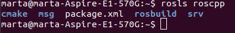

# ROS_Tutorials
Tutorials de ROS

# 2: Sistema de fitxers de ROS

En aquest tutorial se'ns presenten algunes funcions útils per tal d'accedir a paquets de ROS de manera senzilla; aquestes funcions es troben dins del paquet de **rosbash** , on trobem multitud de funcions per facilitar l'ús de ROS.

Per tal de navegar en el sistema de fitxers de ROS, hi ha una funció que retorna el path del paquet demanat; la funció és *rospack*

Si es vol accedir directament al directori, es pot fer servir la comanda *roscd* amb la qual ens portarà diectament al paquet que indiquem. Amb la comanda de linux *pwd* podem veure en quin directori estem.

Per tal d'accedir a informació sobre el paquet, es pot executar directament la comanda de *rosls* seguit del paquet del qual volem obtenir informació.

Una altra utilitat que ens ensenya és que amb el tabulador es pot escriure d'una manera més eficient per tal de no haver d'escriure noms llargs. En cas d'haver diverses opcions que comencin amb el mateix nom, es mostren en el terminal.

## RESUM

Per tant, les funcions a tenir en compte per a un millor ús de ROS són les següents:

- *rospack*, per tal de demanar el directori a on es troba un paquet en concret
- *roscd*, per accedir directament al directori a on es troba el paquet
- *rosls*, per tal d'obtenir directament la informació d'un paquet

Altres utiltats d'aquest tutorial són:

- La comanda *pwd*, per tal de mostrar el directori actual
- El tabulador, per tal d'escriure més ràpid

# 3: Creació d'un paquet amb ROS

Aquest tutorial permet la creació de un primer paquet amb ROS.

Per tal de considerar un paquet de *catkin* com a tal, ha de complir els següents requisits:

- Tenir un fitxer **package.xml** compatible amb *catkin*
- Tenir un **CMakelists.txt** que utilitzi *catkin*
- Tenir la seva pròpia carpeta

Per aquests paquets es recomana utilitzar un espai de treball de *catkin*. Anteriorment en el primer tutorial ja hem creat aquest espai de treball de *catkin*, amb el qual també vam crear el *CMakelists.txt*. 

Per tal de crear un paquet, ens posem a la carpeta *src*; es farà servir la comanda *catkin_create_pkg*, la qual seguirà la següent estructura:

*catkin_create_pkg <package_name> [depend1] [depend2] [depend3]*

En el qual hi posarem el nom del paquet a crear i les dependències de les quals dependrà el paquet.

Dins del paquet *beginner_tutorials* observem que s'han creat els arxius *package.xml* i el *CMakelists.txt*.

Per tal de fer el un *build* al paquet, utilitzem la comanda *catkin_make*. Per tal d'afegir l'espai de treball l'entorn de ROS es fa servir la següent comanda:

*. ~/catkin_ws/devel/setup.bash*

Amb la comanda *rospack depends1 beginner_tutorials* podrem veure les dependències del paquet. Aquestes es troben guardades en el *package.xml*.

Aquestes són les dependències de primer ordre. Aquestes dependències poden tenir les seves pròpies dependències, la qual cos implica que seràn dependències indirectes del paquet. Es poden veure amb la comanda *rospack depends beginner_tutorials*.

En el *package.xml* trobem diversos apartats:

- Descripció del paquet (es troba entre les etiquetes *<description>*)
- Mail del autor, usuari...
- Llicència
- Dependències

## RESUM

- S'ha de tenir en compte els requisits necessaris d'un paquet de *catkin* (fitxers *package.xml* , *CMakelists.txt* i directori)
- S'ha de crear un entorn de *catkin* per tal de treballar amb aquests paquets
- En el paquet tindrem dependències, les quals també tenen les seves pròpies dependències

# 4: Construcció d'un paquet amb ROS

En el tutorial anterior ja s'ha realitzat; amb la comanda *catkin_make*; aquesta comanda és equivalent a totes les comandes del *cmake*, que es combinen en aquesta. Aquesta comanda construeix tots els paquets que es trobin en l'espai de treball de *catkin*. 

Al executar la comanda es veu que es creen les carpetes *build* i *devel*.

# 5: Nodes de ROS

Els nodes són executables que es troben a dins dels paquets de ROS. Aquests nodes es poden comunicar amb altres nodes, publicar missatges als topics, proveir un servei o fer-lo servir.

Per tal de comunicar-se amb altres nodes, aquests utiliten llibreries, les quals permeten la comunicació entre paquets escrits en diferents llenguatges de programació, com per exemple la *rospy* (Phyton) o *roscpp* (C++).

Per tal de començar a utilitzar el ROS, s'ha d'utilitzar primer la comanda *roscore*. A partir d'aquí s'ha de treballar en un altre terminal. 

Si volem veure els nodes actius, podem utilitzar la comanda *rosnode* o la comanda *rosnode list*:

Com es pot veure, lúnic node funcionant en el moment és el *rosout*. Per tal d'obrir un node, es fa servir la comanda

*rosrun [package_name] [node_name]*

En aquest cas hem obert el node *turtlesim_node*:

Si tornem a executar *rosnode list* veurem que també apareix el *turtlesim*.

## RESUM

- Els nodes són executables que es troben a dins dels paquets i que poden comunicar, enviar missatges, proveir o utilitzar serveis i realitzar accions.
- L'entorn de ROS s'executa a partir de la comanda *roscore*; a partir d'aquí es treballa en un altre terminal
- Es visualitzen els nodes actius amb la comanda *rosnode list*
- Existeix un node anomenat *turtlesim* amb el qual es podràn fer proves

# 6: Topics
Per tal de veure el funcionament dels *topics*, es fa servir el *turtlesim*. En el primer moment, s'executa el node turtlesim; seguidament s'executa el node *turtle_teleop_key*, que permetrà moure la tortuga en diverses direccions. Totes aquestes comandes s'han d'executar en nodes diferents.

Per tal de veure el que està passant entre els dos nodes, es pot executar la comanda 

*rosrun rqt_graph rqt_graph*

Apareixerà una pantalla com la següent.

Existeix una eina per tal d'obtenir informació dels *topics* de ROS: *rostopic*. Executant *rostopic -h* obtenim les subcomandes per a aquesta eina:

Observem que hi ha un gran número de comandes:

- **Echo**: serveix per veure les dades que es publiquen en el *topic*. En aquest cas, volem veure les comande de velocitat de la tortuga. Per veure-ho només hem d'executar *rostopic echo /turtle1/cmd_vel* (actuem sobre el topic). Per tal de que funcioni, tots els nodes han de trobar-se executant (*turtlesim* i *turtle_telop_key*).

Si tornem a executar el *rqt_graph* ens apareix de nou la gràfica, veurem que apareix el echo que fem amb la comanda de *rostopic*. S'en diu que el echo es troba suscrit al topic */turtle1/cmd_vel*.

- **List**: retorna una llista dels *topics* que es troben subsrits i publicats en aquell moment. 

En funció del que executem ens ensenyarà els topics d'una manera o altra, o ens dirà x o y informació sobre els *topics*.

- **Type**: serveix per veure el tipus de *topic*, que es determina en funció dels missatges que s'envien per el *topic*. Veurem que el */turtle1/cmd_vel* és del tipus *geometry_msgs/Twist*. Amb la comanda *rosmsg show geometry_msgs/Twist* podem veure els detalls d'aquest tipus de missatge.

- **Pub**: permet publicar dades ens el topic. Executant *rostopic pub -1 /turtle1/cmd_vel geometry_msgs/Twist -- '[2.0, 0.0, 0.0]' '[0.0, 0.0, 1.8]'*, podem enviar un missatge al turtlesim per tal de que es mogui amb les velocitats especificades. La subcomanda *-l* indica que el rostopic només publiqui una vegada.Si volem que la tortuga es segueixi movent, podem fer servir la subcomanda *-r*, amb la qual s'ha d'indicar la ràtio amb la qual volem que es mogui la tortuga en Hz.

Executant la gràfica veurem que el *rostopic es troba publicant missatges al *topic*:

- **Hz**: informa de la ràtio a la qual es publiquen les dades.

Una eina útil per visualitzar les dades de manera gràfica és el plot, que s'executa amb la comanda *rosrun rqt_plot rqt_plot*:

## RESUM

- Podem obtenir informació dels *topics* a partir de la eina *rostopic* i el seu conjunt de subcomandes
- En els *topics* es publiquen els missatges que s'envien els nodes
- El tipus de topic el determina a partir del tipus de missatge que es publica
- Els nodes estaran subscrits al *topic* o publicaràn en ell

# 7: Serveis i paràmetres de ROS

Un servei és una altra manera de comunicació entre nodes, fent servir la comunicació pregunta(request)-resposta(response). La comanda que permet utilitzar serveis s'anomena *rosservice*.

El node turtlesim disposa de nou serveis. Aquests es poden veure a partir de la comanda *rosservice list*

Podem saber quin tipus de servei es tracta amb la comanda *rosservice type*. Per tal de cridar el servei simplement s'executa *rosservice call [servei]*. El servei */clear* permet netejar la pantalla del *turtlesim*.

Un dels serveis de *turtlesim* permet afegir una nova tortuga en la finestra, en una posició determinada. Al contrari que el servei */clear*, que simplement neteja, aquest necessita arguments d'entrada per poder executar-se (en aquest cas la posició de la tortuga).

Només cal indicar la posició i angle, i la funció ens retornarà el nom assignat a la tortuga.

Una altra comanda a utilitar és *rosparam*. Aquesta permet guardar i manipular les dades en el servidor de paràmetres de ROS. Podem veure que el turtlesim disposa de diversos paràmetres:

Amb la comanda *rosparam set [paràmetre]* podem canviar els valors dels paràmetres, seguit d'un *rosservice call /clear*, o obtenir el valor dels paràmetres amb la comanfa *rosparam get [paràmetre]*. Per exemple els paràmetres */background_r*, */background_g* i */background_b* controlen el color del fons de pantalla del *turtlesim*.

També podem guardar dades d'aquests paràmetres en els fitxers .yaml amb les comandes *rosparam dump* i *rosparam load*.

## RESUM

- Els nodes es poden comunicar a través dels serveis; un node pot tenir una quantitat de serveis disponibles
- Els serveis es podran manipular a partir de la comanda *rosservice*
- Els nodes poden tenir paràmetres, que aquests es podràn modificar i guardar les seves dades a partir de la comanda *rosparam*

# 10: Creació de msg i srv

Els serveis i missatges són elements que es troben integrats en la comunicació en el ROS. Tindrem dos tipus d'arxius, els **msg** i els **srv**.

- msg: són arxius de text que descriuen les característiques d'un missatge de ROS. Es guarden en el directori *msg* d'un paquet. Poden tenir tipus de variables o un tipus especial anomenat *header*.

- srv: és un arxiu de servei. Es composa d'una pregunta i una resposta. Les dues parts es troben separades amb una línia de *--*. Es guarden en el directori *srv*.

Per tal de generar missatges i serveis, s'han de modificar els arxius [Package.xml](https://github.com/Martygp95/ROS_Tutorials/blob/master/Arxius/package.xml) i [CMakelists.txt](https://github.com/Martygp95/ROS_Tutorials/blob/master/Arxius/CMakeLists.txt) tal com diu el tutorial.

Algunes comandes noves que s'han fet servir són *roscp*, per copiar arxius a directoris, i *rosmsg*, per tal de mostrar informació sobre missatges.

